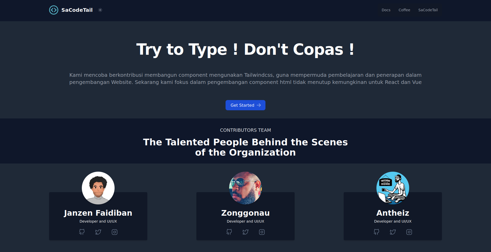

# How to Run this Project

1. You can clone this project first
2. Go to root directory project end type comman  "<b>npm install</b>" and "<b>npm run start</b>"
3. build tailwindcss on you're project, type comman  "npx tailwindcss -i ./src/style.css -o ./public/css/style.css --watch"
4. if you make tailwindcss CDN don't folow step number 3.
5. All page format ejs (Embedded javascript Template)

# SaCode Tailwind CSS Components

✅ Completed  
⌛ In progress  

## Marketing

⌛ Hero Sections  
⌛ Feature Sections  
⌛ CTA Sections  
⌛ Pricing Sections  
⌛ Header Sections  
⌛ FAQs  
⌛ Newsletter Sections  
⌛ Stats  
⌛ Testimonials  
⌛ Blog Sections  
⌛ Contact Sections  
⌛ Team Sections  
⌛ Content Sections  
⌛ Footers  
⌛ Logo Clouds  

## Elements

⌛ Headers  
⌛ Banners  
⌛ Flyout Menus  

## Feedback

⌛ 404 Pages  

## Page Examples

⌛ Landing Pages  
⌛ Pricing Pages  
⌛ Contact Pages  
